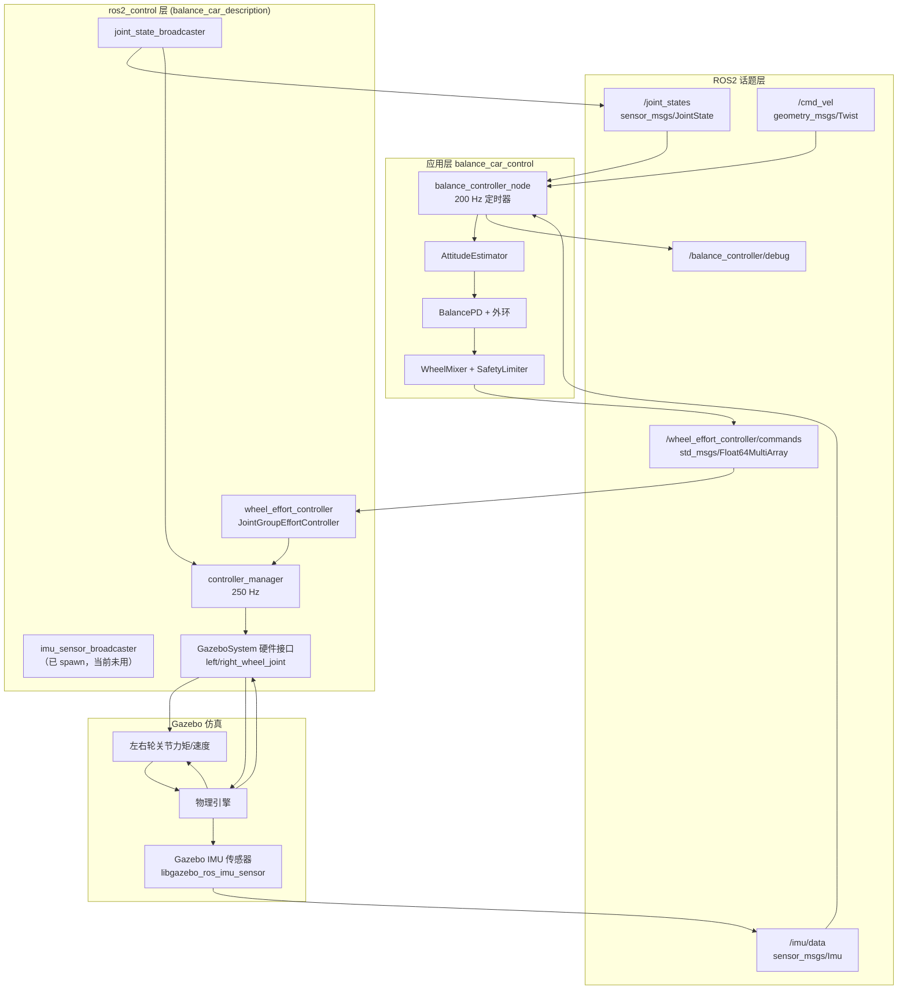

<!--
 * @Author: LCOIT dogcat.let@gmail.com
 * @Date: 2026-06-19 23:26:34
 * @LastEditors: LCOIT dogcat.let@gmail.com
 * @LastEditTime: 2026-06-19 23:26:49
 * @FilePath: /two_wheel_self_balance_car/docs/design_system.md
 * @Description: 这是默认设置,请设置`customMade`, 打开koroFileHeader查看配置 进行设置: https://github.com/OBKoro1/koro1FileHeader/wiki/%E9%85%8D%E7%BD%AE
-->
