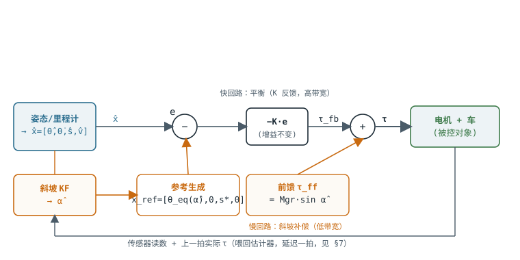

# 把斜坡角接进 LQR

> TWIP 平衡车 · 控制集成卷 · 前馈斜坡补偿
>
> 副标题：前馈力矩 + 平衡点搬移的完整控制链路

估计器算出的 $\hat{\alpha}$ 怎么用？直接「折算成一个力加进去」——对了**一半**。前馈力矩解决「出多少力顶住坡」，但漏掉另一半：坡上的平衡姿态根本不是竖直的。只补前馈不搬平衡点，LQR 会执着地把车拉回竖直、与保持力矩持续对抗。

本卷给出完整控制律

$$
\tau = \tau_{\mathrm{ff}}(\hat{\alpha}) - K\bigl(\hat{x} - x_{\mathrm{ref}}(\hat{\alpha})\bigr)
$$

并论证它为什么不破坏原有 LQR 的平衡。

## 先厘清：alpha 不是状态 {#not-state}

一个常见的误接法：把 $\hat{\alpha}$ 塞进状态向量、给它配一个反馈增益。**这是错的。** LQR 的状态 $x=[\theta,\dot{\theta},s,v]$ 是「机器人自己的运动状态」，控制器的使命是把它们调节到参考值。而 $\alpha$ 是**环境属性**，不是你要调节的对象——你无法「把坡度控制到零」。$\hat{\alpha}$ 的正确身份是**已知扰动**：它改变了系统的平衡点和维持平衡所需的力，控制器要做的是**补偿**它，而不是**反馈**它。

补偿这个扰动，恰好需要两个动作，对应坡上平衡的两个特征（理论卷式 8）：

$$
\tau_{\mathrm{eq}} = M g r \sin\alpha
\quad\text{（坡上定点需要持续力矩）};\quad
\sin\theta_{\mathrm{eq}} = \frac{M r}{m_b L}\sin\alpha
\quad\text{（且车体必须前倾）}
$$

- $\tau_{\mathrm{eq}}\neq 0$ → 需要**前馈力矩**把这份持续力矩直接送出去。这就是「折算成力」。
- $\theta_{\mathrm{eq}}\neq 0$ → 需要**搬移 LQR 的平衡点**，告诉它「坡上该稳在 $\theta_{\mathrm{eq}}$，不是 0」。这一半最容易漏。

> **为什么 $\theta_{\mathrm{eq}}$ 不能忽略：** 你这台车 $Mr/(m_b L)\approx 1$（$r\approx L$），所以 **$\theta_{\mathrm{eq}}\approx\alpha$**——10° 坡上车体要前倾约 10°，与坡角同量级。若 LQR 参考仍是 $\theta=0$，它会拼命把这 10° 前倾「纠正」回竖直，而竖直在坡上不是平衡态，于是持续对抗——这正是「LQR 与保持力矩打架」的机理。


## 完整控制链路框图 {#block-diagram}



$\hat{\alpha}$ 从两个入口进入控制律：① 经参考生成搬移 $x_{\mathrm{ref}}$（改变「零误差」的定义）；② 经前馈算出 $\tau_{\mathrm{ff}}$（直接叠加到力矩）。LQR 的 $K$ 反馈回路完全不变（黑色主干）。两个橙色入口都在低频。

一句话读图：**橙色是斜坡补偿（慢、开环性质），黑色是原有平衡回路（快、闭环反馈）**。$\hat{\alpha}$ 不穿过 $K$，所以它不改变平衡动态——这是后文「不破坏平衡」的图形直觉。

## 前馈力矩 tau_ff {#feedforward}


### 公式与出处

$$
\tau_{\mathrm{ff}} = M g r \cdot \sin\hat{\alpha}
$$

出处是坡上定点的力平衡：重力沿坡分量 $Mg\sin\alpha$ 产生拖车的力，乘轮半径 $r$ 得到需要在轮轴上抵消的力矩。前馈**开环、即时**地把这份已知力矩送出去，不等 LQR 通过「发现车在往下滑 → 误差 → 反馈纠正」那条慢链路去补。

### 它是力矩，直接加在 LQR 输出上

$\tau_{\mathrm{ff}}$ 与 LQR 输出 $\tau_{\mathrm{fb}}=-K\cdot e$ 同量纲，在同一个求和点相加：

$$
\tau = \tau_{\mathrm{fb}} + \tau_{\mathrm{ff}} = -K\cdot e + M g r \sin\hat{\alpha}
$$

落地时的两个换算细节：

- **单轮 / 双轮：** $\tau$ 是作用在整车上的**总**轮力矩。若接口给每个电机单独下发，平地直行时左右平分 $\tau/2$；转向另有差速叠加。
- **力矩 → 电机指令：** 若接口不是力矩而是电压/PWM，用电机模型换算。仿真里 effort 接口直接就是力矩，无需换算。


### 你的车的数字

$M=0.756$、$r=0.0325$、$g=9.8$：$MGR=M\cdot g\cdot r=\mathbf{0.2408}$，故 $\tau_{\mathrm{ff}}=0.2408\cdot\sin\hat{\alpha}$。10° 坡：$\tau_{\mathrm{ff}}\approx\mathbf{0.0418\mathrm{N\cdot m}}$——与「坡上悬停力矩」一致。

> **只做到这一步会怎样？** 车能获得 holding 力矩、不至于一上坡就下滑；但由于 LQR 参考仍是 $\theta=0$，它会把坡上自然的前倾 $\theta_{\mathrm{eq}}$ 当成误差去纠正——导致**稳态位置漂移或持续的姿态-位置拉锯**。所以平衡点搬移不是可选项。


## 平衡点搬移 theta_eq {#equilibrium}


### 为什么坡上平衡姿态不是竖直的

物理根源在电机的**反作用力矩**（$Q_\theta=-\tau$）。给轮子施加 $\tau_{\mathrm{ff}}$ 顶住坡的同时，$-\tau_{\mathrm{ff}}$ 作用在车体上往后掀。要抗住后掀，车体必须**前倾**，用重力对轮轴的力矩来平衡：

$$
m_b g L \sin\theta_{\mathrm{eq}} = \tau_{\mathrm{eq}} = M g r \sin\alpha
\quad\Longrightarrow\quad
\sin\theta_{\mathrm{eq}} = \frac{M r}{m_b L}\sin\alpha
$$

你的车系数 $\approx 1$，所以**坡多陡，车体就得前倾多少**。这不是控制误差，是坡上唯一的真实平衡姿态。

### 怎么搬：改参考，不改增益

LQR 是个**调节器**，行为是「把 $x$ 拉到参考 $x_{\mathrm{ref}}$」。搬平衡点 = 把参考里的俯仰分量从 0 改成 $\theta_{\mathrm{eq}}(\hat{\alpha})$：

$$
x_{\mathrm{ref}}(\hat{\alpha}) = \bigl[\theta_{\mathrm{eq}}(\hat{\alpha}),\ 0,\ s^{*},\ v^{*}\bigr]^{T},\quad
\theta_{\mathrm{eq}}(\hat{\alpha})\approx\frac{M r}{m_b L}\sin\hat{\alpha}
$$

小角度下 $\theta_{\mathrm{eq}}\approx\sin\theta_{\mathrm{eq}}$，直接用右边乘积即可，无需 $\mathrm{asin}$。$s^{*}$、$v^{*}$ 是目标位置/巡航速度，与坡无关。完整控制律：

$$
\tau = M g r \sin\hat{\alpha} - K\bigl(\hat{x} - x_{\mathrm{ref}}(\hat{\alpha})\bigr)
$$

### 两半如何咬合：在真实平衡点上一切归零

设车正好停在坡上真实平衡态，即 $\hat{x}=x_{\mathrm{ref}}$（$\hat{\theta}=\theta_{\mathrm{eq}}$、$v=0$、在目标位置）：

$$
\tau = M g r \sin\hat{\alpha} - K\cdot\mathbf{0} = \tau_{\mathrm{eq}}
$$

> **结论 4.1（两半缺一不可）**　在真实平衡点上，**前馈项独自提供全部所需力矩 $\tau_{\mathrm{eq}}$，LQR 反馈项恰好为零**——LQR 不再「使劲」，因此不与保持力矩对抗。前馈负责「出力」，参考搬移负责「让 LQR 闭嘴」。缺前馈：反馈项要独自扛 $\tau_{\mathrm{eq}}$，必然带稳态误差；缺搬移：LQR 把 $\theta_{\mathrm{eq}}$ 当误差纠正，与前馈打架。


## 为什么不破坏原有 LQR 平衡 {#stability}


### 增益 K 一个字没动

前馈是**开环**加法项（不含 $x$ 的反馈路径），参考搬移只改**设定值**（不改 $K$）。闭环特征方程由 $A-BK$ 决定，而 $A$、$B$、$K$ 全部不变，所以**平衡回路的极点、阻尼、带宽与平地时完全相同**。

### 线性化点虽移，动态几乎不变

严格说坡上应绕 $(\theta_{\mathrm{eq}},\tau_{\mathrm{eq}})$ 重新线性化，$A$、$B$ 会微变。但变化是**二阶小量**：车体回复刚度 $\propto\cos\theta_{\mathrm{eq}}$，$\theta_{\mathrm{eq}}=10°$ 时 $\cos=0.985$，只变 1.5%。为 $\theta=0$ 设计的 $K$ 在 $\theta_{\mathrm{eq}}=10°$ 处仍然稳定。所以**固定 $K$ + 搬参考**足够，不必做增益调度。

### 频带分离：斜坡补偿走低频，平衡走高频


| 回路                               | 带宽 / 时间常数                      | 由谁驱动           |
| -------------------------------- | ------------------------------ | -------------- |
| 平衡（$K$ 反馈 $\theta,\dot{\theta}$） | 快，几十 rad/s                     | 不变             |
| 斜坡估计（KF）                         | 慢，$\tau\approx 0.14\mathrm{s}$ | $\hat{\alpha}$ |
| 坡本身变化                            | 更慢（车速决定）                       | 环境             |


$\hat{\alpha}$ 只从 $\tau_{\mathrm{ff}}$ 和 $x_{\mathrm{ref}}$ 两个**低频入口**进入，不参与高频平衡博弈。即便 $\hat{\alpha}$ 有零点几秒滞后，最坏也只是上坡头前馈欠补、由快速 LQR 临时兜底——不会动摇平衡稳定性。

> **一个诚实的裂缝：** 这套 LQG（EKF + LQR）不像纯 LQR 那样有保证的稳定裕度。若把斜坡估计带宽调得逼近平衡带宽，两个回路频带重叠，裕度会缩水。工程含义：**斜坡估计宁慢勿快**——反正坡本身变化很慢。


## 完整控制律与伪代码 {#code}

下面的伪代码与实际实现（`lqr_backend.py` 的 `compute()`）逐行对应。注意比理论式多了一个 **(A0) α̂ 调理**步骤——这是实车调试补上的（原理见 [§实车调试补遗](#field-fixes)），理论上的 $\sin\hat{\alpha}$ 在代码里全部换成调理后的 $\sin_{\mathrm{eff}}$：

```python
# balance_controller 控制周期内执行（lqr_backend.compute）
def control_step(x_hat, alpha_hat, v_cmd, dt):
    # x_hat = [theta, theta_dot, s, v]；alpha_hat 来自 /slope/alpha（200 Hz，读最新值）

    # ---- (A0) α̂ 调理：死区 + 低通 + 软启动（实车必需，见 §field-fixes）----
    a = alpha_hat if abs(alpha_hat) >= DEADBAND else 0.0    # 死区 0.015 rad
    alpha_f += (dt / (LPF_SEC + dt)) * (a - alpha_f)        # 一阶低通 τ=0.5 s
    ramp = min(1.0, t_since_enable / RAMP_SEC)              # 使能后 2 s 渐入
    sin_eff = GAIN * ramp * sin(alpha_f)                    # 两半共用同一个 sin_eff！

    # ---- (A) 平衡点搬移：参考随坡移动 ----
    theta_eq = K_EQ * sin_eff                   # K_EQ = M*r/(m_b*L) ≈ 1.0
    # x_ref 生成含 x_dot_ref 斜坡限幅（0.3 m/s²，防停车回退，见 §field-fixes）
    x_ref = reference.update(v_cmd, dt, theta_eq)

    # ---- (B) LQR 反馈：增益 K 不变 ----
    tau_fb = -dot(K, x_hat - x_ref)             # K 为平地设计的 1x4 增益

    # ---- (C) 前馈力矩：折算重力沿坡分量（单轮，故总力矩 /2）----
    tau_ff_wheel = 0.5 * MGR * sin_eff          # MGR = M*g*r = 0.2408

    # ---- (D) 合成，限幅，下发 ----
    tau = clamp(tau_fb + tau_ff_wheel, -TAU_MAX, TAU_MAX)

    # ---- (E) 关键：估计器读到的必须是"实际下发的总力矩"（含前馈）----
    # 实现上估计器直接订阅 /wheel_effort_controller/commands，天然满足
    return tau
```

与框图逐块对应：(A0) α̂ 低频化、(A) 参考生成、(B) $-K\cdot e$、(C) $\tau_{\mathrm{ff}}$、(D) 力矩求和、(E) 回送估计器。

实现参数一览（`balance_lqr.yaml`）：


| 参数                     | 默认值     | 作用                                                          |
| ---------------------- | ------- | ----------------------------------------------------------- |
| `slope_ff_enabled`     | `true`  | 斜坡补偿总开关（$\tau_{\mathrm{ff}}$ 与 $\theta_{\mathrm{eq}}$ 一起开关） |
| `slope_ff_gain`        | `0.5`   | 同时缩放两半的弱增益；稳定后提到 1.0（=严格物理配对）                               |
| `slope_ff_ramp_sec`    | `2.0`   | 使能后补偿 0→gain 软启动时长                                          |
| `slope_alpha_deadband` | `0.015` | [rad] α̂ 死区，平地小抖动不进补偿                                       |
| `slope_alpha_lpf_sec`  | `0.5`   | [s] α̂ 一阶低通时间常数                                             |
| `slope_k_eq`           | `0`     | $K_{\mathrm{EQ}}$；0=启动时由 xacro 自动算 $r/L$                    |
| `lqr_ref_accel_limit`  | `0.3`   | [m/s²] $\dot{x}_{\mathrm{ref}}$ 斜坡限幅，防停车回退                  |


> **巡航爬坡时的补充前馈：** 若目标是匀速上坡（$v^{*}\neq 0$）而非定点，稳态还要克服摩擦：$\tau_{\mathrm{ff}}=Mgr\sin\hat{\alpha}+c\cdot v^{*}$。定点保持（$v^{*}=0$）时该项自动消失。


## 三个工程接缝 {#engineering}


### 代数环：tau 既是输出又是估计器输入

$\tau$ 里含 $\tau_{\mathrm{ff}}(\hat{\alpha})$，而斜坡 KF 的 $z_{\mathrm{dyn}}$ 又拿 $\tau$ 反推 $\hat{\alpha}$——形成回路。正确接法：估计器使用**上一控制周期实际下发的总力矩**（含前馈），回路是延迟一拍的稳定回路。**绝不能**用「去掉前馈的残差力矩」去推 $\hat{\alpha}$——那会把坡度信息减掉，$\hat{\alpha}$ 塌缩到 0。伪代码 (E) 就是这个接法。

### 抗积分饱和（若加了积分项）

若为消除稳态误差在 LQR 外叠加了位置/速度积分（LQI），上坡时前馈已顶住大部分重力，积分器不应再重复累积——否则力矩饱和后积分继续 winding，退坡时反冲。做法：把 $\tau_{\mathrm{ff}}$ 视为已知补偿，积分器只对**补偿后的残差**积分；力矩 clamp 触发时冻结积分（标准 anti-windup）。

### 无扰切换：为什么这里天然平滑

$\hat{\alpha}$ 来自 KF，本身连续无跳变，所以 $\tau_{\mathrm{ff}}$ 和 $\theta_{\mathrm{eq}}$ 都平滑变化。唯一要注意的是**启动瞬间**：KF 的 $\hat{\alpha}$ 初值若非当前真实坡度，前馈会有初始误差。实现上做了三重防护：估计器假定平地起步（前 3 s 对外发 0，之后 1 s 线性渐入，避免阶跃）；控制器侧 `slope_ff_ramp_sec` 让补偿在使能后 2 s 内 0→gain 渐入；α̂ 低通再兜底平滑一切残余跳变。

## 实车调试补遗：四个必须堵住的缺口 {#field-fixes}

上面的控制律在数学上闭合，但第一次上车就暴露了症状：**平地站立时车前后缓慢移动，坡上也来回晃；行进中发停止命令后车会倒退一段**。本节记录四个根因与修复——它们都不是「调参问题」，而是理论到实现之间缺失的结构件。

### 缺口 1：α̂ 高频直通造成自激回路（平地/坡上来回移动）

**机理。** [§频带分离](#stability)说了「斜坡估计宁慢勿快」，但只把 KF 调慢并不够——$\hat{\alpha}$ 从估计器到控制律之间还有一条没设防的高频通路。把整条链画出来：

$$
\text{车动} \to \tau,\dot{v}\text{ 波动} \to z_{\mathrm{dyn}}\text{ 波动} \to \hat{\alpha}\text{ 波动}
\to \theta_{\mathrm{eq}},\tau_{\mathrm{ff}}\text{ 波动} \to \text{车又动}
$$

这是一个闭环。致命处在 $\theta_{\mathrm{eq}}$ 这一入口：$K_{\mathrm{EQ}}\approx 1$，α̂ 抖多少 rad，俯仰参考就抖多少 rad，LQR 会**忠实执行**「前倾→加速→后仰→倒车」。平地上 LQR 位置保持的力矩摆动被 $z_{\mathrm{dyn}}$ 通道读成假坡度，于是回路自激，表现为慢速来回移动——平地和坡上都有。

**修复：α̂ 入环前做死区 + 低通（**`compute()` **的 A0 步）。**

- **死区**（`slope_alpha_deadband=0.015` rad ≈0.9°）：平地上 α̂ 的估计噪声典型幅度在此以内，死区直接把它归零——零点附近**回路增益为 0，环从根上断开**。真坡（5° ≈ 0.087 rad）远超死区，不受影响。
- **一阶低通**（`slope_alpha_lpf_sec=0.5` s）：把 α̂ 的入环带宽压到约 2 rad/s，与平衡回路的几十 rad/s 拉开一个数量级，坡上残余的低频回路增益也被压低。这才是「频带分离」的完整落地：估计器慢是必要条件，**控制器入口再低频化**才是充分条件。

代价是上坡瞬间补偿滞后约 0.5 s，这段时间由快速 LQR 反馈临时兜底——正是 §频带分离 允许的工况。

### 缺口 2：增益与软启动必须同时作用于两半

第一版实现把弱增益 `slope_ff_gain` 和软启动 `ramp` 只乘在 $\tau_{\mathrm{ff}}$ 上，$\theta_{\mathrm{eq}}$ 全额生效。这拆散了[结论 4.1](#equilibrium) 的配对：姿态参考已搬到坡上平衡点，力却只给了一半，LQR 反馈被迫补差，且 ramp 期间两半比例还在漂移——车始终处在「参考与前馈互相不认账」的状态。

**修复：两半共用同一个缩放后的 $\sin_{\mathrm{eff}} = k\cdot\mathrm{ramp}\cdot\sin\hat{\alpha}_f$：**

$$
\theta_{\mathrm{eq}} = K_{\mathrm{EQ}}\cdot\sin_{\mathrm{eff}},\qquad
\tau_{\mathrm{ff}} = MGR\cdot\sin_{\mathrm{eff}}
$$

这样任意 $k\in[0,1]$ 下两半始终成配对：等效于「按 $k$ 折算的坡度」做完整补偿，残差 $(1-k)MGR\sin\alpha$ 由 LQR 以可预期的稳态偏差承担。$k=1$ 时退化为严格物理配对。

### 缺口 3：估计器起步的阶跃（假定平地起步）

站立瞬间大力矩会污染 $z_{\mathrm{dyn}}$，KF 起步几秒内的 α̂ 不可信。估计器（`slope_dyn_obs_node`）假定平地起步：前 3 s 对外发布 $\hat{\alpha}=0$。但「到点瞬间跳回 KF 当前值」是一个阶跃，会直接打进 $\theta_{\mathrm{ref}}$——所以 hold 结束后再用 1 s **线性渐入**真实 KF 值。调试话题里的 `data[12]` 始终是未处理的 KF 真值，两者可对照。

### 缺口 4：停车回退——x_ref 冻结 vs 刹车距离

**机理。** 原参考生成在停止指令当拍冻结 $x_{\mathrm{ref}}$、$\dot{x}_{\mathrm{ref}}$ 阶跃归零。但平衡车物理上不可能瞬停：刹车必须先让轮子短暂加速、把车体甩到后仰姿态才开始减速，实际位置必然冲过冻结点一个刹车距离（$\approx v^2/2a$，几厘米到几十厘米）。随后 $k_x$ 位置项把车**拉回冻结点**——这就是停车后倒退，平地上就能复现，坡上再叠加 α̂ 的刹车瞬态下陷，倒退更长。

**修复：参考速度斜坡限幅（**`lqr_ref_accel_limit=0.3` **m/s²，**`lqr_reference.py`**）。** 停止指令不再让参考阶跃归零，而是 $\dot{x}*{\mathrm{ref}}$ 按限幅滑到 0，$x*{\mathrm{ref}}$ 一路积分到**自然停点**后冻结。原理一句话：**参考轨迹必须物理可行**——参考加速度不超过车实际能执行的减速度，跟踪误差就不会积累成事后要「还账」的位置差。以 0.195 m/s 巡航为例，停止指令后参考 0.65 s 滑到 0、多前进 6.5 cm（恰为刹车距离），车沿参考减速，无超调、无回拉。副产品：起步同样被限幅，加速更柔和。

### 缺口 5：急刹瞬态被 $z_{\mathrm{dyn}}$ 读成假坡度（停车后二次鼓包）

**机理。** 缺口 4 解决了「停车倒退」，但把 LQR 阻尼调紧、消除力矩饱和之后，又暴露出一个更隐蔽的现象：车速降到接近 0 后并没有直接停住，而是先小幅**反向加速**、鼓一个包，再被拉停一次——两段振荡之间夹着一段平滑的"二次起步"。

根源不在 LQR，在 `slope_dyn_obs_node.py` 的动力学通道：

$$
\sin_{\mathrm{dyn}} = \frac{\tau_f/r - \tilde{m}\dot v - c\cdot v}{Mg}
$$

这个式子假定 $\tau_f$（力矩，0.1 s 低通）与 $\dot v$（加速度，独立 0.1 s 低通）处于**稳态比例关系**——平地匀速或匀加速时成立。但急刹车是全车动态里最剧烈的瞬态：$\tau$ 和 $\dot v$ 各自的滤波相位错位在此刻被放大到最明显，$\sin_{\mathrm{dyn}}$ 短暂算出一个几度到十几度的**假坡度**。这个假 $\hat\alpha$ 经 $\theta_{\mathrm{eq}}=K_{\mathrm{EQ}}\hat\alpha$（$K_{\mathrm{EQ}}\approx1$）直接搬动姿态参考，车被真实地推着走了一段——直到 $\hat\alpha$ 沿 0.5 s 低通衰减回 0（3τ~5τ ≈ 1.5~2.5 s，与实测鼓包宽度一致），LQR 才把这段"二次漂移"再拉停一次。

这与缺口 1 的自激回路是**同一类风险的两种触发方式**：缺口 1 是平地小抖动被反复放大成持续振荡；缺口 5 是单次剧烈瞬态被误读成一次性假坡度脉冲。缺口 1 的死区/低通治的是"稳态噪声通道"，对这种瞬态脉冲触发的单次误读并不充分——脉冲幅度往往远超死区阈值，只是持续时间短。

**曾经尝试的修复（已回退，见下）：给 $z_{\mathrm{dyn}}$ 接瞬态门控。** 运动学通道 $z_{\mathrm{kin}}$ 早就用 `kin_gate = |vdot| > vdot_gate` 判断"当前是否处于剧烈瞬态"（只是用于反向——加速度大时更信任 $z_{\mathrm{kin}}$）。曾复用同一个 `kin_gate`，瞬态期间把 $z_{\mathrm{dyn}}$ 的观测噪声从 $R_{\mathrm{dyn}}=0.4$ 抬到 $R_{\mathrm{dyn,hi}}=5.0$，并在门控松开后再拖 `dyn_gate_hold_sec=1.5s` 才恢复正常信任度（思路同 `safety_limiter` 的 `trip_debounce_sec`），压住了急刹车瞬时误读和其后的纠偏余振鼓包。

**但这套门控只覆盖"瞬态"，覆盖不到"稳态巡航"——而后者才是更根本的坑。** 在恒定坡度上匀速巡航时，$|\dot v|$ 一直很小（振荡本身产生的加速度量级远低于 `vdot_gate`），门控从头到尾不会触发，$z_{\mathrm{dyn}}$ 全程用基础权重 $R_{\mathrm{dyn}}=0.4$ 参与更新——此时它和缺口 1 描述的回路（车动→τ,v̇波动→z_dyn波动→α̂波动→θ_eq,τ_ff波动→车又动）完全不设防，只是这次振荡频率更低（实测周期 10~14 s），缺口 1 的 0.5 s 低通对这个频段几乎不衰减（低通截止约 2 rad/s，而振荡角频率仅 ≈0.45~0.6 rad/s，衰减不到 10%），于是长期维持一个不衰减的自持振荡（限幅环）。

**第二次尝试：给 $\sin_{\mathrm{eff}}$ 加斜率限幅（已回退）。** 思路是直接限制 $\sin_{\mathrm{eff}}$ 每秒最大变化量，从"幅值"外的另一个维度切断维持振荡所需的回路增益，不依赖频率选择性。上车验证后发现**完全没有效果**——量化复盘原因：振荡本身的峰值变化速率 $\approx$ 振幅 $\times$ 角频率 $\approx 0.0175\times0.45\approx0.008\,\mathrm{rad/s}$，而设定的限幅阈值 $0.03\,\mathrm{rad/s}$ 比它还大 4 倍，限幅器全程从未真正触发。要卡住这个振荡，阈值得降到 $<0.008$ 这个量级——但那样一来，遇到真实坡度，补偿爬到正常值（如 $\sin\alpha\approx0.15$）需要 $0.15/0.005\approx30\,\mathrm{s}$，爬坡响应慢到不可用。**结论：在这个频段上，"压振荡"和"跟真坡"这两个目标用同一个阈值分不开，斜率限幅这条路对这类低频自激振荡不成立。**

**曾经的结论：以上两次尝试（$R_{\mathrm{dyn,hi}}$+去抖门控、$\sin_{\mathrm{eff}}$ 斜率限幅）已从代码中回退**，`slope_dyn_obs_node.py` 与 `lqr_backend.py` 一度恢复到只有缺口 1～4 修复的基线状态，先回到最简单的开环前馈基线重新逐步验证。**后续排查发现真正病根是缺口 6 描述的 $c$ 严重低估——两次门控尝试治的都是症状，没找到病根，见缺口 6。**

### 缺口 6：$c$ 严重低估——平地/坡上抖动的真正病根 {#c-calibration}

回退门控/限幅之后，用录制的 rosbag 反过来查数据，才找到缺口 5 和"坡上慢速自激振荡"共同的病根：`slope_dyn_obs_node.py` 里 $c$ 的初始值 `0.1` 被严重低估了，**真实值大约是它的 39 倍**。

$c$ 是 $\sin_{\mathrm{dyn}}$ 公式里摩擦/耗散项的系数：

$$
\sin_{\mathrm{dyn}} = \frac{\tau_f/r - \tilde{m}\dot v - c\cdot v}{Mg}
$$

平地上真实坡度 $\alpha=0$，理论上只要车在动（$v\neq0$），这个式子就必须靠 $c\cdot v$ 把 $\tau_f/r-\tilde m\dot v$ 这部分残余力矩抵消掉。$c$ 定得太小，$c\cdot v$ 抵消不掉多少，残余力矩就会被 $\sin_{\mathrm{dyn}}$ 全部当成"坡度"读出来——车只要一动（不管是平地小抖动，还是坡上巡航时速度的正常波动），就会诱发一次假坡度读数，再经 $\theta_{\mathrm{eq}}$ 反过来扰动车的运动，形成缺口 1/5 反复描述的那个自激回路。**门控和限幅都是在下游拦这个假读数，$c$ 标定错误才是上游的真实病因——上游堵不上，下游怎么拦都是治标。**

#### 怎么标定：最小二乘拟合（一次性、离线，非在线 RLS）

拿一段**平地**上、车有明显运动（$v$ 不为 0，非静止）的 rosbag，此时真值 $\alpha=0$，公式两边同时除以 $Mg$ 再移项：

$$
\underbrace{\frac{\tau_f}{r} - \tilde m\dot v}_{y_i}\ \approx\ c\cdot\underbrace{v}_{x_i}
$$

$\tilde m$（`m_eff`）用整车质量/惯量算出的物理值直接固定不动，$\tau_f$、$\dot v$、$v$ 都是录到的实测序列，第 $i$ 个采样点算出一对 $(x_i,y_i)$。**只有一个未知数 $c$**，要在成千上万个采样点里找一个 $c$，让 $c\cdot x_i$ 整体上最接近 $y_i$——这就是最小二乘：

$$
c^\star=\arg\min_c \sum_i (y_i-c\cdot x_i)^2
\quad\Longrightarrow\quad
c^\star=\frac{\sum_i x_i y_i}{\sum_i x_i^2}
$$

**这个封闭解怎么来的：** 对目标函数 $J(c)=\sum_i(y_i-cx_i)^2$ 求导并令其为 0：

$$
\frac{dJ}{dc}=\sum_i 2(y_i-cx_i)(-x_i)=0
\ \Longrightarrow\ \sum_i x_iy_i=c\sum_i x_i^2
\ \Longrightarrow\ c^\star=\frac{\sum_i x_iy_i}{\sum_i x_i^2}
$$

**几何直觉：** 把全部采样点的 $x_i$ 摆成一个长向量 $\mathbf{x}\in\mathbb{R}^N$（$N$=采样点数），$y_i$ 摆成另一个向量 $\mathbf{y}$。$c^\star\mathbf{x}$ 就是 $\mathbf{y}$ 在 $\mathbf{x}$ 方向上的**正交投影**，$c^\star=\dfrac{\mathbf{x}\cdot\mathbf{y}}{\mathbf{x}\cdot\mathbf{x}}$ 正是投影系数——本质上是在问"$y$ 这个信号里，有多大比例是跟 $x$（也就是 $v$）成正比的"，这个比例就是 $c$。

**为什么强制过原点（不带截距）：** 物理上 $v=0$ 时车没在动，摩擦/耗散项必须严格为 0，所以拟合直线必须穿过原点，不能像一般线性回归那样额外拟合一个截距项。实测里额外拟合一下截距，截距对应的角度偏差只有 **-0.14°**（噪声量级），印证了这个物理约束本身就是对的，不是强加的。

**标定结果与稳健性验证：** 用一段确认是平地、时长 28s 的数据（约 9000+ 个采样点）算出 $c^\star=3.916$。为了确认不是偶然拟合到噪声，把数据从中间切成两半分别单独拟合：前半段 $c=3.908$，后半段 $c=3.921$，两次独立结果几乎一致——这说明 $c$ 是这段数据里一个稳定的物理常数，不是过拟合出来的噪声。

$$
c: 0.1 \ \longrightarrow\ 3.916
$$

**效果：** 改完之后用同一份 bag 复算 $\sin_{\mathrm{dyn}}$，平地段抖动标准差从 0.091 降到 **0.019**（≈5.2°→1.1°噪声），坡上停稳段和巡航段的抖动标准差也分别降到约 1/4 和 1/2，而角度**均值**基本不变（说明没有引入新偏置，只是抵消了原来该抵消而没抵消的噪声）。上车验证后，多次坡上启动都能快速稳定停下，缺口 5 描述的鼓包和"坡上慢速自激振荡"都不再需要额外的门控/限幅去压——**病根找对了，症状自然消失，不需要再叠补丁**。

**与"RLS"（在线递归最小二乘）的区别：** 这里做的是**离线批量最小二乘**（一次性拿一整段历史数据算出唯一的 $c$，算完就定死写进代码），不是真正的 RLS（Recursive Least Squares）。RLS 是同一个最小二乘目标函数的**在线递归形式**：每来一个新采样点 $(x_i,y_i)$，不重新遍历全部历史数据，而是用上一步的估计 $c_{i-1}$ 和一个增益 $k_i$ 递推更新：

$$
c_i = c_{i-1} + k_i\,(y_i - c_{i-1}x_i),\qquad
k_i = \frac{P_{i-1}x_i}{\lambda + x_i^2P_{i-1}},\qquad
P_i=\frac{1}{\lambda}\bigl(P_{i-1}-k_ix_iP_{i-1}\bigr)
$$

$P$ 是估计方差（对应最小二乘里的 $1/\sum x_i^2$），$\lambda\in(0,1]$ 是遗忘因子（$<1$ 时让久远的数据逐渐"过期"，能跟踪随时间缓慢漂移的真实 $c$，比如轮胎磨损、地面材质变化）。**跟这里用的 KF 结构其实是同一族算法**——本质都是"新息（残差）乘增益、再累加到旧估计上"，只是 RLS 递推的是一个常数参数 $c$，KF 递推的是一个随时间变化的状态 $\alpha$。如果未来想让 $c$ 能在车跑起来的过程中自动持续校准（而不是像现在这样离线标一次就写死），可以把这段 RLS 递推直接加进 `slope_dyn_obs_node.py`，用平地/低置信度坡度的时间段喂它更新——但现在离线标一次已经把问题解决了，暂不需要这个复杂度。

## 验证实验与增益调度 {#verify}


### 三步验证

1. **只开前馈、不搬参考（复现 bug）：** 故意只加 $\tau_{\mathrm{ff}}$、保持 $\theta_{\mathrm{ref}}=0$，上坡定点。观察到位置持续漂移或 $\theta$ 与位置的拉锯——亲眼确认「另一半」的必要性。
2. **两半都开（正确）：** 加上 $\theta_{\mathrm{eq}}$ 搬移。车体应稳定前倾到 $\approx\theta_{\mathrm{eq}}$、位置无漂移、LQR 反馈项 $\tau_{\mathrm{fb}}$ 稳态趋近于零（把 $\tau_{\mathrm{fb}}$ 单独打日志，它归零就是「不打架」的铁证）。
3. **接入前后对比：** 记录接入斜坡补偿前后，上坡过程中 $\theta$ 的稳态偏差与 LQR 输出幅值。应能复现并解决「LQR 与斜坡补偿对抗」的现象。


### 什么时候才需要增益调度

小坡度下固定 $K$ 足够。当坡度大到 $\cos\theta_{\mathrm{eq}}$ 明显偏离 1（比如 $>25°$，$\cos$ 掉到 0.9 以下），或对性能极致要求时，可让 $K$ 随 $\hat{\alpha}$ 查表（增益调度）：离线为若干 $\alpha$ 值各解一次 LQR，运行时按 $\hat{\alpha}$ 插值。对平衡车常规坡度，收益通常不抵复杂度，建议先用固定 $K$ 跑通。

## 检查清单与常见误解 {#checklist}


| 误解                                            | 纠正                                                        |
| --------------------------------------------- | --------------------------------------------------------- |
| 「把 $\hat{\alpha}$ 加进状态向量配个增益」                 | $\alpha$ 是扰动不是状态，走前馈 + 参考搬移，不进反馈                          |
| 「折算成前馈力就够了」                                   | 只是一半；不搬 $\theta_{\mathrm{eq}}$，LQR 会与前馈打架                 |
| 「要重新设计 LQR / 重调 $K$」                          | $K$ 不动，小坡度线性化变化是二阶小量                                      |
| 「$\theta_{\mathrm{eq}}$ 是控制误差，应该消掉」           | $\{\mathrm{eq}}$ 是坡上唯一真实平衡姿态，应当作参考theta_                  |
| 「估计器用 $\tau_{\mathrm{fb}}$ 反推 $\hat{\alpha}$」 | 必须用含前馈的实际总力矩，否则坡度信息被减掉                                    |
| 「$\hat{\alpha}$ 直接进控制律，KF 慢就够了」               | 控制器入口还要死区 + 低通，否则 α̂→θ_ref→运动→τ→α̂ 自激（缺口 1）               |
| 「弱增益/软启动只压 $\tau_{\mathrm{ff}}$ 就行」           | 会拆散配对；增益与 ramp 必须同时缩放两半（缺口 2）                             |
| 「停止指令时 $x_{\mathrm{ref}}$ 原地冻结」               | 实际位置冲过冻结点后被拉回 = 停车倒退；$\dot{x}_{\mathrm{ref}}$ 要斜坡限幅（缺口 4） |
| 「$z_{\mathrm{dyn}}$ 只要低通调够慢就不会误判」           | 急刹瞬态和巡航低频振荡表面看是两种误判，实际共享同一个上游病根：$c$ 严重低估（缺口 5/6） |
| 「振荡要靠门控/限幅在下游拦」                          | 门控、限幅都是治标；$c$ 标错是上游病因，标定 $c$ 才是治本（缺口 6） |


> **落地顺序建议：** ① 先在平地确认原 LQR 平衡不受影响（$\hat{\alpha}=0$ 时 $\tau_{\mathrm{ff}}=0$、$\theta_{\mathrm{eq}}=0$，控制律退化为原样）；② 用固定坡度、喂真值 $\alpha$ 验证前馈 + 搬移逻辑；③ 再接入斜坡 KF 的 $\hat{\alpha}$ 闭环。分三步能把「控制集成」与「估计精度」两类问题解耦。

---

控制集成卷 · 控制律 $\tau = MGR\cdot\sin_{\mathrm{eff}} - K(\hat{x}-x_{\mathrm{ref}})$，其中 $\sin_{\mathrm{eff}}=k\cdot\mathrm{ramp}\cdot\sin\hat{\alpha}*f$（α̂ 经死区 0.015 rad + 低通 0.5 s 调理）。参数：$M=0.756$、$r=0.0325$、$g=9.8$、$MGR=0.2408$、$K*{\mathrm{EQ}}\approx 1.0$、参考限幅 0.3 m/s²。实现：`lqr_backend.py` / `lqr_reference.py` / `slope_dyn_obs_node.py`，参数集中在 `balance_lqr.yaml`。配套：理论卷平衡解与 LQG、简化实现卷（$\hat{\alpha}$ 来源）。